# window-functions

[](https://travis-ci.org/scijs/window-functions) [](http://badge.fury.io/js/window-functions)  [](https://david-dm.org/scijs/window-functions)

Window functions for digital signal processing

# Introduction

Among other uses, [window functions](http://en.wikipedia.org/wiki/Window_function) help control [spectral leakage](http://en.wikipedia.org/wiki/Spectral_leakage) when doing Fourier Analysis. This collection of window functions is copied directly from Wikipedia.

# Example

An example of applying a Hamming window to a signal array:

```javascript
var wfunc = require('window-functions'),
    i, N = signal.length;

for(i=0; i<N; i++) {
  signal[i] *= wfunc.hamming(i,N)
}
```

But really, there are lots of cosines and function evaluations in many of these windows, so if you reuse the window, it may be beneficial to precalculate and reuse it.

# Usage

Simply pass the window the sample number and total number of samples to calculate the value of the window function for the given sample.

The plots below are calculated directly from the npm module and plotted with matplotlib to illustrate the spectral leakage. See [window functions](http://en.wikipedia.org/wiki/Window_function) for more details.


#### `bartlettHann( i, N )`:

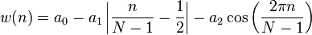


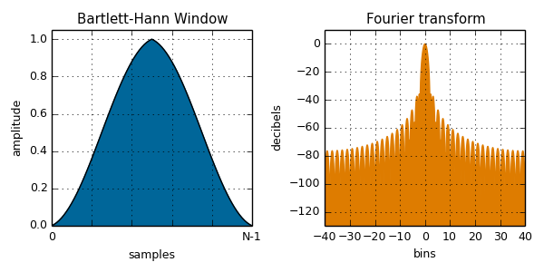

#### `bartlett( i, N )`:

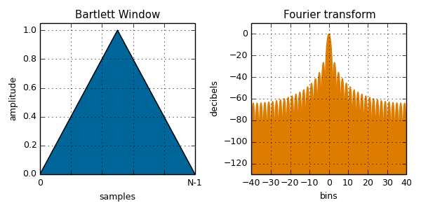

#### `blackman( i, N )`:

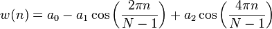

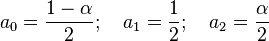

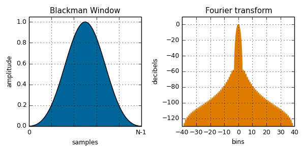

#### `blackmanHarris( i, N )`:

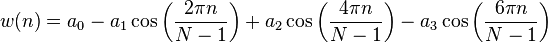

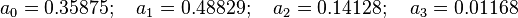

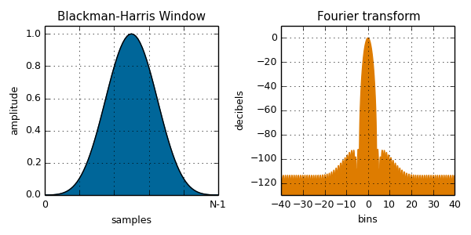

#### `blackmanNuttall( i, N )`:


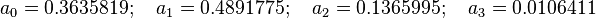

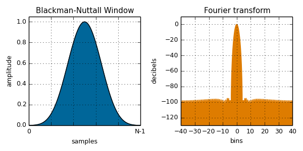

#### `cosine( i, N )`:

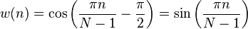


#### `exactBlackman( i, N )`:


#### `flatTop( i, N )`:

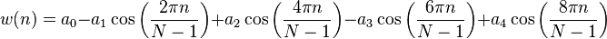

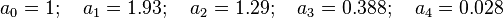

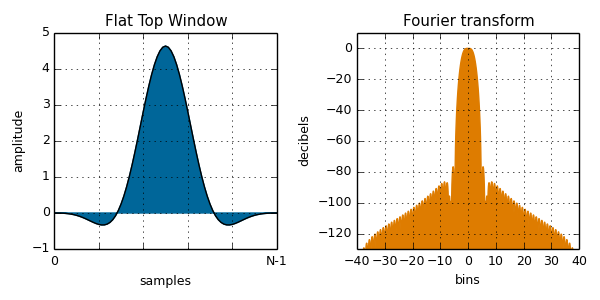

#### `gaussian( i, N, sigma )`:

Sigma controls the width of the window.

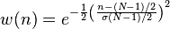

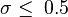

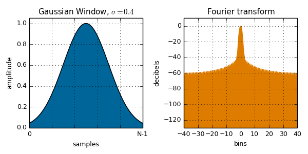

#### `hamming( i, N )`:

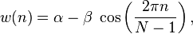

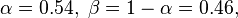

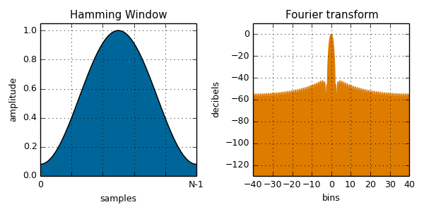

#### `hann( i, N )`:

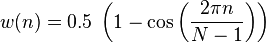

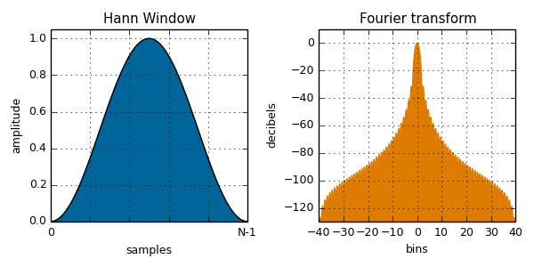

#### `lanczos( i, N )`:

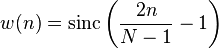

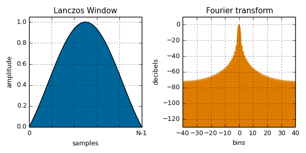

#### `nuttall( i, N )`:


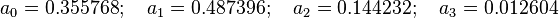

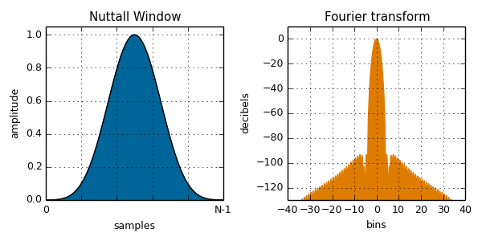

#### `rectangular( i, N )`:

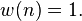

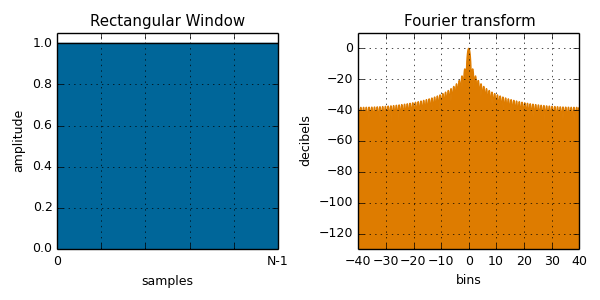

#### `triangular( i, N )`:

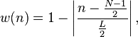

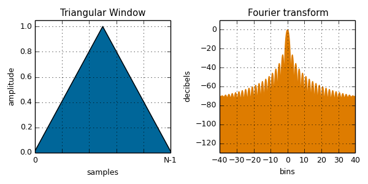

#### `tukey( i, N, alpha )`:

A tapered cosine window. Alpha controls the relative width of the flat section. Alpha=0 is rectangular, alpha=1 is Hann.  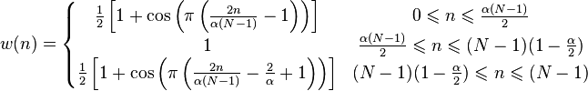

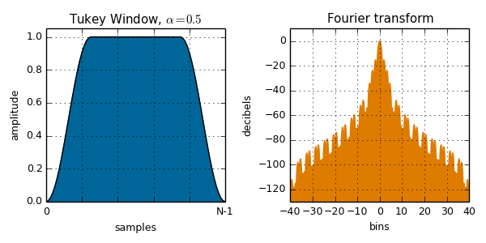

#### `welch( i, N )`:

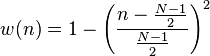

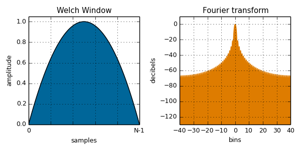


## Credits
Window function definitions and equation images from [Wikipedia: Window Function](http://en.wikipedia.org/wiki/Window_function).

(c) 2015 Ricky Reusser. MIT License
